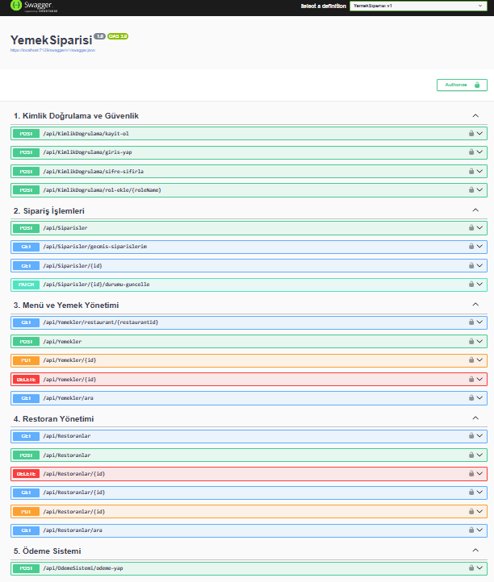
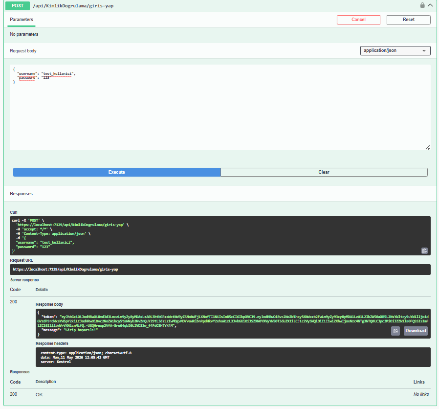
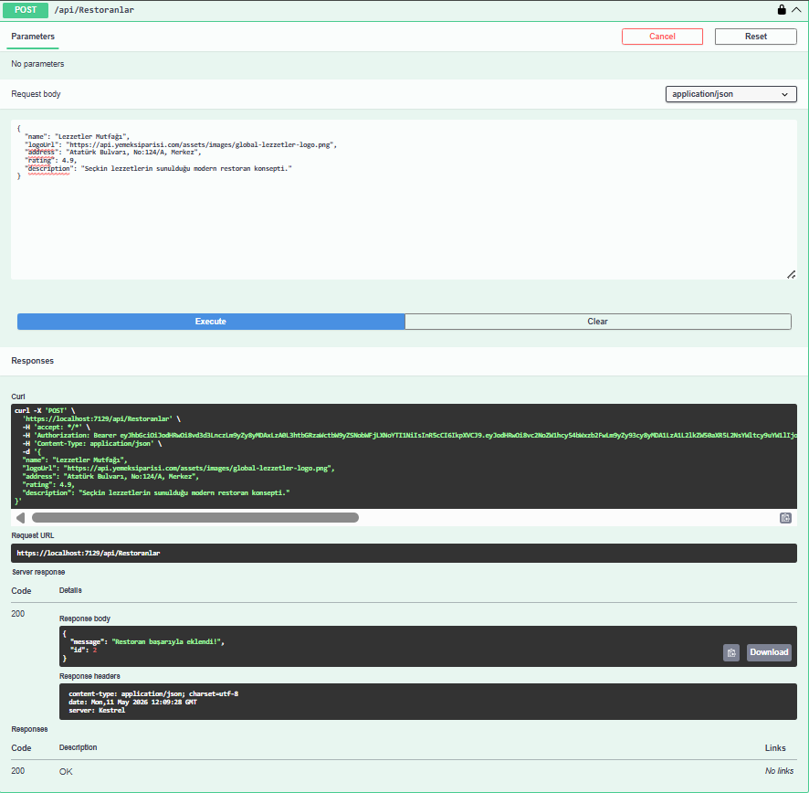
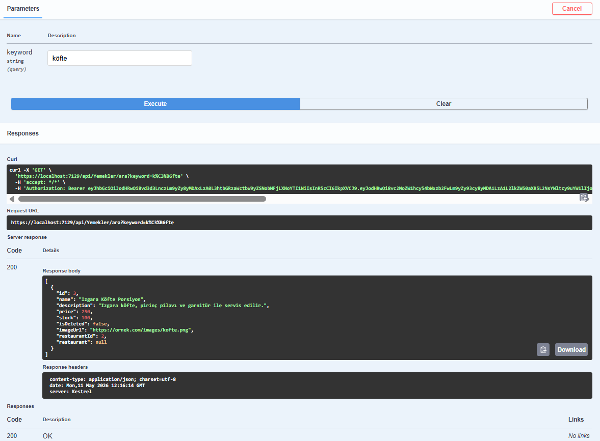

# Yemek Sipariş Sistemi API

Bu proje, ASP.NET Core Web API kullanılarak geliştirilmiş bir yemek sipariş sistemi backend uygulamasıdır.

Projede temel CRUD işlemlerinin yanı sıra JWT tabanlı kimlik doğrulama, rol bazlı yetkilendirme, stok yönetimi, sipariş sistemi ve veri bütünlüğünü korumaya yönelik güvenlik mekanizmaları geliştirilmiştir.

---

# Kullanılan Teknolojiler

- **Backend:** C# & ASP.NET Core Web API
- **ORM:** Entity Framework Core (Code-First)
- **Veritabanı:** MSSQL Server
- **Güvenlik:** JWT Authentication & BCrypt.Net (Parola Hashleme)
- **Dokümantasyon:** Swagger/OpenAPI (Türkçeleştirilmiş API Dokümantasyonu)

---

# Kimlik Doğrulama ve Roller

Projede JWT tabanlı authentication sistemi bulunmaktadır ve yetkilendirmeler `[Authorize(Roles="...")]` yapısı ile korunmaktadır.

Veritabanı ilk oluştuğunda roller otomatik olarak eklenmektedir (Seed Data).

## Roller

### Admin
- Sistemi yönetebilir
- Rol ekleyebilir

### RestaurantOwner
- Sadece kendi restoranını yönetebilir
- Kendi menüsüne ürün ekleyebilir
- Kendi siparişlerinin durumunu güncelleyebilir

### Customer
- Restoranları görüntüleyebilir
- Ürünleri listeleyebilir
- Sipariş oluşturabilir
- Kendi sipariş geçmişini görüntüleyebilir

---

# Gelişmiş Özellikler ve İş Mantığı

## Kullanıcı İşlemleri
- Güvenli kayıt ve giriş sistemi
- BCrypt ile parola hashleme
- JWT tabanlı token üretimi
- Eski şifre doğrulamalı şifre sıfırlama sistemi
- Otomatik admin kullanıcı oluşturma (Seeding)

## Restoran ve Ürün İşlemleri
- Restoran CRUD işlemleri
- Ürün CRUD işlemleri
- Soft Delete (Mantıksal Silme) sistemi
- Restoran sahibine özel yetkilendirme kontrolleri
- Restoran ve ürün arama sistemi

## Sipariş ve Ödeme İşlemleri
- Sipariş oluşturma sistemi
- Sipariş geçmişi görüntüleme
- Sipariş durum güncelleme
- Stok kontrolü ve otomatik stok düşürme
- Boş sepet kontrolü
- Basit ödeme simülasyonu

---

# Veritabanı Tabloları

- `Users`
- `Roles`
- `Restaurants`
- `Products`
- `Orders`
- `OrderItems`

---

# API Endpoint Örnekleri

## Kimlik Doğrulama ve Güvenlik

```http
POST   /api/KimlikDogrulama/kayit-ol
POST   /api/KimlikDogrulama/giris-yap
POST   /api/KimlikDogrulama/sifre-sifirla
POST   /api/KimlikDogrulama/rol-ekle/{roleName}
```

---

## Sipariş İşlemleri

```http
POST   /api/Siparisler
GET    /api/Siparisler/gecmis-siparislerim
GET    /api/Siparisler/{id}
PATCH  /api/Siparisler/{id}/durum-guncelle
```

---

## Menü ve Yemek Yönetimi

```http
GET    /api/Yemekler/restaurant/{restaurantId}
POST   /api/Yemekler
PUT    /api/Yemekler/{id}
DELETE /api/Yemekler/{id}
GET    /api/Yemekler/ara
```

---

## Restoran Yönetimi

```http
GET    /api/Restoranlar
POST   /api/Restoranlar
DELETE /api/Restoranlar/{id}
GET    /api/Restoranlar/{id}
PUT    /api/Restoranlar/{id}
GET    /api/Restoranlar/ara
```

---

## Ödeme Sistemi

```http
POST   /api/OdemeSistemi/odeme-yap
```

---

# Kurulum

## 1 Projeyi Klonlayın

```bash
git clone PROJE_LINKI_BURAYA
```

---

## 2 Veritabanı Bağlantısını Düzenleyin

`appsettings.json` dosyasındaki `DefaultConnection` alanını kendi SQL Server yapılandırmanıza göre güncelleyin.

---

## 3 Migration ve Veritabanını Oluşturun

```powershell
Update-Database
```

---

## 4 Projeyi Çalıştırın

```bash
dotnet run
```

Swagger arayüzü otomatik olarak açılacaktır.

---

# Test İçin Varsayılan Admin Hesabı

Uygulama ilk çalıştırıldığında otomatik olarak bir admin kullanıcısı oluşturulur.

```txt
Kullanıcı Adı: admin
Şifre: 123
```

---

# Swagger Desteği

API endpointleri Swagger arayüzü üzerinden test edilebilir.

Swagger sayesinde:
- Endpoint testleri yapılabilir
- JWT token ile yetkilendirme denenebilir
- Request/Response yapıları görüntülenebilir

---
# Proje Ekran Görüntüleri

### 1. Türkçeleştirilmiş API Arayüzü (Swagger)


### 2. JWT Kimlik Doğrulama (Login & Token Üretimi)


### 3. Rol Bazlı İşlem (Restoran Ekleme)


### 4. Başarılı İstek ve JSON Yanıtı (Arama İşlemi)



---